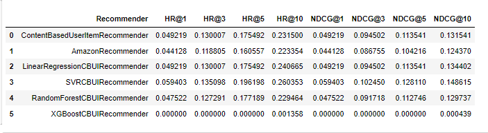

## Project Description
HotelRecommender is a recommender that recommends the most suitable hotel deals based on the content provided.

The project was done as part of the "Recommendation Systems" course at Adam Mickiewicz University in Poznan. The goal of the project was to create a content-based recommender that gets the highest hr10 possible.

The project has several relevant sections:
- folder data - csv files containing the data on which the recommender was trained and tested
- project_1_data_preparation.ipynb - jupyter netbook having methods to prepare data for the recommender
- project_1_recommender_and_evaluation.ipynb - jupyter netbook containing the recommender, derived recommenders to test the results on different regression models, tuning methods to identify the best parameters for the recommender with a given regression model

The project also includes .html files for previewing the results of the netbook sections.

In the recomender, after analyzing the results of various regression models, the SVR model was found to be the best. A one-hot encoding technique was used to prepare the user and item features.

## Scores


## Used Technologies
- [anaconda](https://www.anaconda.com/)
- [python](https://www.python.org/)
- [jupyter netbook](https://jupyter.org/)
- [pandas](https://pandas.pydata.org/)
- [numpy](https://numpy.org/)
- [matplotlib](https://matplotlib.org/)
- [seaborn](https://seaborn.pydata.org/)
- [sklearn](https://scikit-learn.org/stable/)
- [hyperopt](https://github.com/hyperopt/hyperopt)

## Instalation
Before installation, make sure you have installed on your computer
- anaconda 3
- python 3.10+
1. Create new conda environment
```
conda env create --name hotel-recommender -f environment.yml
conda activate hotel-recommender
```
2. Launch jupyter netbook
```
jupyter notebook
```
3. Enter project_1_data_preparation.ipynb or project_1_recommender_and_evaluation.ipynb
